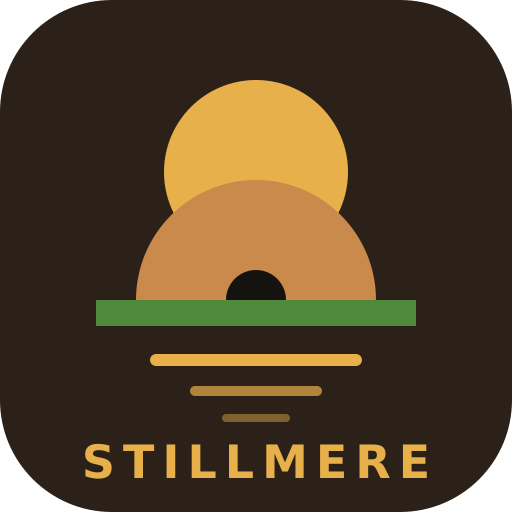

<p align="center">
  
</p>

<h1 align="center">Stillmere</h1>

<p align="center">
  A colony survival simulation for Android, written from scratch in Kotlin.<br>
  Survive a hostile frontier, build a settlement, and eventually build a ship to leave.
</p>

<p align="center">
  <a href="https://github.com/teamomuito/rimworld/releases/latest/download/colony.apk"><b>Download the APK</b></a>
  &nbsp;·&nbsp;
  <a href="#building-from-source">Build from source</a>
  &nbsp;·&nbsp;
  <a href="#support-rimworld">Support RimWorld</a>
</p>

---

## About

Stillmere is a fan-made, original implementation of the colony-simulation genre, inspired by
RimWorld by Ludeon Studios. It is not affiliated with or endorsed by Ludeon Studios, and it contains no
RimWorld code or assets. All art is drawn procedurally at runtime, and all code in this repository is
original.

The project aims to play like its inspiration without adding DLC content. Balance numbers are the author's own
tuning. There is no mod support, and caravan battles take place on a small temporary map without player
control of the outcome beyond drafting, moving and retreating.

## Features

**Colonists**
- 33 backstories, 12 skills with passions, 42 traits, work priorities for 18 job types, and a 24-hour schedule.
- Needs for food, rest, joy and temperature, combined into a mood built from dozens of thoughts.
- Mental breaks, social interaction, romance, marriage, rivalries and family.
- Life stages: children grow up, adults form pregnancies, and old age brings chronic conditions.
- Per-colonist outfit and drug policies, food policies, and drug use with tolerance, addiction and withdrawal.

**Health**
- Body-part health for 29 human parts, with organs, hit locations, armor, penetration, bleeding, pain,
  consciousness, infection, scarring and lost limbs. Capacities such as moving and manipulation follow the parts.
- Doctors tend wounds with herbal or industrial medicine; hospital beds heal faster.
- Illness and environmental hazards: flu, plague, malaria, sleeping sickness, parasites, hypothermia, heatstroke,
  frostbite, malnutrition and food poisoning.

**Base building**
- 65 buildings, many of them multi-tile: walls, doors, beds, tables, workbenches, lighting, heating, power,
  defences, traps, turrets, mortars, graves and art.
- Rooms are detected from walls and have temperature, beauty, cleanliness and impressiveness values.
- Stockpile, growing and dumping zones with item filters, quality limits and priorities.
- Workbench bills for cooking, butchery, tailoring, smithing, machining, stonecutting and medicine.
- Power grids with solar, wind, wood and battery storage. Fire spreads, rain puts it out, and lightning can start it.

**World**
- Six biomes, rivers, lakes, five rock types, six ores, caves, seasons, rain, fog, snow, thunderstorms,
  cold snaps and heat waves.
- Crops that depend on temperature, light and soil; spoilage of food and corpses; items that wear outdoors.
- Wildlife for hunting, taming, slaughter and breeding.

**World map, factions and caravans**
- A generated planet with hills, mountains, rivers, lakes, roads and six factions. The colony's tile sets its biome.
- Faction goodwill and standing, and relations between factions. Hostile factions raid with their own gear.
- Caravans carry goods by weight and travel across the map. Ambushes become battles on a temporary map,
  using the same weapons, cover, wounds and AI as colony fights.
- Settlements can be traded with, supplied, or attacked. Bandit camps can be cleared for rewards.
- Quests with acceptance, deadlines and consequences, and rescue missions for colonists taken captive.

**Threats and events**
- Three storytellers and five difficulty levels.
- Raids that scale with colony wealth: assaults, sappers, sieges and drop pods.
- Manhunter packs, insect infestations, disease, solar flares, eclipses, toxic fallout, short circuits, blight,
  meteorites, volcanic winter, crashed mechanoid ships, wandering colonists and trade caravans.
- Prisoners can be captured, recruited, or ransomed back to their faction.

**Progress**
- A research tree of 53 projects covering crafts, firearms, power and the ship.
- Four scenarios. Launch the ship to win.
- Automatic and manual saves.

## Install

1. Download **[colony.apk](https://github.com/teamomuito/rimworld/releases/latest/download/colony.apk)** on an
   Android phone running Android 8.0 or later. This link always points to the newest build. Older builds are on the
   [releases page](https://github.com/teamomuito/rimworld/releases).
2. Open the file and allow installs from your browser or file manager when Android asks.
3. If Android refuses to update an older build, uninstall it first.

Saves are kept on the device. The in-app updater downloads newer builds and keeps saves across updates.

## How to play

The main menu offers **Continue**, **New colony**, **Tutorial colony**, **Settings** and **How to play**.
The optional tutorial walks through the basics one step at a time. It can be skipped or turned off in Settings.

The game is landscape only. Drag to pan, pinch to zoom, and tap to inspect. **Menu → How to play** has the full
guide.

## Building from source

The code is split into two modules:

- `sim/` is plain Kotlin (JVM): the whole simulation and its unit tests. It has no Android dependencies.
- `app/` is the Android application: the canvas renderer, touch controls and interface.

```sh
./gradlew :sim:test                        # simulation tests; no Android SDK needed
./gradlew -PwithApp :app:assembleRelease   # requires the Android SDK
```

The APK is written to `app/build/outputs/apk/release/`. The `Build APK` workflow builds it on every push
and uploads it as an artifact.

## Support RimWorld

Stillmere exists because RimWorld exists. If you enjoy this game, please support the original developers and
buy **RimWorld** from [rimworldgame.com](https://rimworldgame.com/). Its depth, mods and expansions are the work of
Ludeon Studios, and buying it is the best way to keep that work going.

## Legal

Stillmere is an independent fan project. "RimWorld" is a trademark of Ludeon Studios. This project is not affiliated
with, sponsored by or endorsed by Ludeon Studios.
